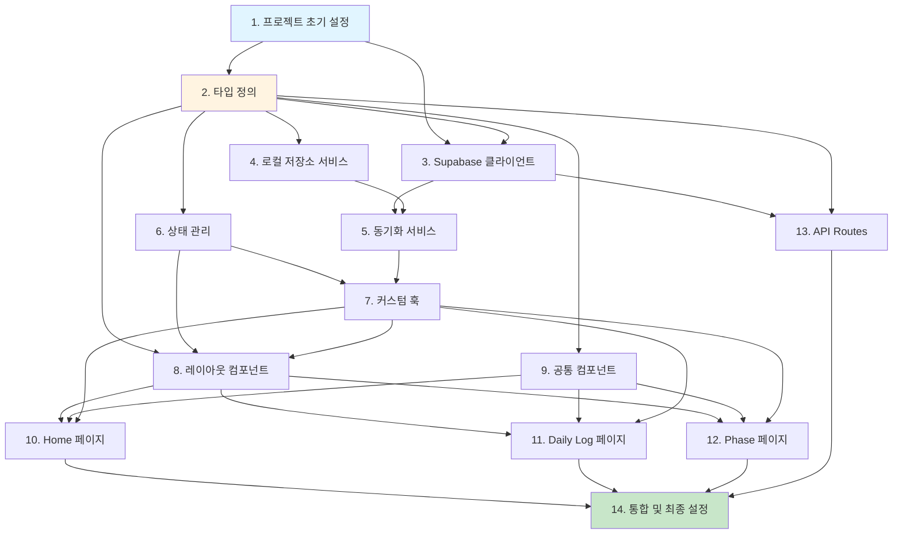

# LIFE OS - 프론트엔드 개발 통합 가이드
## 작업 분장 및 통합 가이드

**버전**: v0.1  
**작성일**: 2025-01-27  
**기준 문서**: 
- [lifeos_PRD.md](../../lifeos_PRD.md)
- [user_stories.md](../../user_stories.md)
- [software_design.md](../../software_design.md)

---

## 작업 단위 개요

프론트엔드 개발을 **14개의 독립적인 작업 단위**로 분리하여 병렬 개발이 가능하도록 구성했습니다.

### 작업 단위 목록

1. **프로젝트 초기 설정** (`01-front-setup-plan.md`)
2. **타입 정의** (`02-front-types-plan.md`)
3. **Supabase 클라이언트 설정** (`03-front-supabase-plan.md`)
4. **로컬 저장소 서비스** (`04-front-localstorage-plan.md`)
5. **동기화 서비스** (`05-front-sync-plan.md`)
6. **상태 관리** (`06-front-state-plan.md`)
7. **커스텀 훅** (`07-front-hooks-plan.md`)
8. **레이아웃 컴포넌트** (`08-front-layout-plan.md`)
9. **공통 컴포넌트** (`09-front-common-plan.md`)
10. **Home 페이지** (`10-front-home-plan.md`)
11. **Daily Log 페이지** (`11-front-dailylog-plan.md`)
12. **Phase 페이지** (`12-front-phase-plan.md`)
13. **API Routes** (`13-front-api-plan.md`)
14. **통합 및 최종 설정** (`14-front-integration-plan.md`)

---

## 작업 의존성 다이어그램



---

## 작업 단위별 상세 정보

### Phase 1: 기반 설정 (순차 작업)

#### 1. 프로젝트 초기 설정
- **파일**: `01-front-setup-plan.md`
- **의존성**: 없음
- **병렬 가능**: ❌ (모든 작업의 기반)
- **예상 소요 시간**: 2-3시간
- **결과물**: 
  - Next.js 프로젝트 구조
  - TypeScript 설정
  - Tailwind CSS 설정
  - 기본 디렉토리 구조

#### 2. 타입 정의
- **파일**: `02-front-types-plan.md`
- **의존성**: 프로젝트 초기 설정
- **병렬 가능**: ❌ (다른 작업의 기반)
- **예상 소요 시간**: 1-2시간
- **결과물**:
  - `types/database.ts`
  - `types/components.ts`
  - `types/state.ts`

---

### Phase 2: 인프라 구축 (병렬 가능)

#### 3. Supabase 클라이언트 설정
- **파일**: `03-front-supabase-plan.md`
- **의존성**: 프로젝트 초기 설정, 타입 정의
- **병렬 가능**: ✅ (4번과 병렬)
- **예상 소요 시간**: 1-2시간
- **결과물**:
  - `lib/supabase.ts`
  - `.env.local` 예시

#### 4. 로컬 저장소 서비스
- **파일**: `04-front-localstorage-plan.md`
- **의존성**: 타입 정의
- **병렬 가능**: ✅ (3번과 병렬)
- **예상 소요 시간**: 3-4시간
- **결과물**:
  - `services/LocalStorageService.ts`
  - IndexedDB 설정

---

### Phase 3: 서비스 레이어 (순차 작업)

#### 5. 동기화 서비스
- **파일**: `05-front-sync-plan.md`
- **의존성**: Supabase 클라이언트, 로컬 저장소 서비스
- **병렬 가능**: ❌
- **예상 소요 시간**: 4-5시간
- **결과물**:
  - `services/SyncService.ts`
  - 동기화 로직

#### 6. 상태 관리
- **파일**: `06-front-state-plan.md`
- **의존성**: 타입 정의, 로컬 저장소 서비스
- **병렬 가능**: ✅ (5번과 병렬)
- **예상 소요 시간**: 3-4시간
- **결과물**:
  - `contexts/AppContext.tsx`
  - `reducers/appReducer.ts`

---

### Phase 4: 훅 및 컴포넌트 (병렬 가능)

#### 7. 커스텀 훅
- **파일**: `07-front-hooks-plan.md`
- **의존성**: 상태 관리, 동기화 서비스
- **병렬 가능**: ✅ (8, 9번과 병렬)
- **예상 소요 시간**: 3-4시간
- **결과물**:
  - `hooks/useLocalStorage.ts`
  - `hooks/useSync.ts`
  - `hooks/useBaseline.ts`

#### 8. 레이아웃 컴포넌트
- **파일**: `08-front-layout-plan.md`
- **의존성**: 타입 정의, 상태 관리
- **병렬 가능**: ✅ (7, 9번과 병렬)
- **예상 소요 시간**: 4-5시간
- **결과물**:
  - `components/layout/Sidebar.tsx`
  - `components/layout/Header.tsx`
  - `app/layout.tsx`

#### 9. 공통 컴포넌트
- **파일**: `09-front-common-plan.md`
- **의존성**: 타입 정의
- **병렬 가능**: ✅ (7, 8번과 병렬)
- **예상 소요 시간**: 2-3시간
- **결과물**:
  - `components/common/Button.tsx`
  - `components/common/Toggle.tsx`
  - `components/common/Card.tsx`

---

### Phase 5: 페이지 개발 (병렬 가능)

#### 10. Home 페이지
- **파일**: `10-front-home-plan.md`
- **의존성**: 레이아웃, 공통 컴포넌트, 훅
- **병렬 가능**: ✅ (11, 12번과 병렬)
- **예상 소요 시간**: 4-5시간
- **결과물**:
  - `app/page.tsx`
  - `components/home/BaselineCard.tsx`
  - `components/home/ResetButton.tsx`
  - `components/home/PhaseIndicator.tsx`

#### 11. Daily Log 페이지
- **파일**: `11-front-dailylog-plan.md`
- **의존성**: 레이아웃, 공통 컴포넌트, 훅
- **병렬 가능**: ✅ (10, 12번과 병렬)
- **예상 소요 시간**: 4-5시간
- **결과물**:
  - `app/daily-log/page.tsx`
  - `components/daily-log/DailyLogForm.tsx`
  - `components/daily-log/DatePicker.tsx`

#### 12. Phase 페이지
- **파일**: `12-front-phase-plan.md`
- **의존성**: 레이아웃, 공통 컴포넌트, 훅
- **병렬 가능**: ✅ (10, 11번과 병렬)
- **예상 소요 시간**: 2-3시간
- **결과물**:
  - `app/phase/page.tsx`
  - `components/phase/PhaseSelector.tsx`

#### 13. API Routes
- **파일**: `13-front-api-plan.md`
- **의존성**: Supabase 클라이언트, 타입 정의
- **병렬 가능**: ✅ (10, 11, 12번과 병렬)
- **예상 소요 시간**: 3-4시간
- **결과물**:
  - `app/api/user/route.ts`
  - `app/api/baseline/route.ts`
  - `app/api/daily-log/route.ts`
  - `app/api/sync/route.ts`

---

### Phase 6: 통합 및 배포

#### 14. 통합 및 최종 설정
- **파일**: `14-front-integration-plan.md`
- **의존성**: 모든 작업
- **병렬 가능**: ❌
- **예상 소요 시간**: 3-4시간
- **결과물**:
  - 모든 컴포넌트 통합
  - 환경 변수 설정
  - Vercel 배포 설정
  - 최종 테스트

---

## 작업 순서 권장사항

### 최적 병렬 작업 시나리오

**Week 1: 기반 구축**
- Day 1-2: 작업 1, 2 (순차)
- Day 3-4: 작업 3, 4 (병렬)
- Day 5: 작업 5, 6 (병렬)

**Week 2: 컴포넌트 개발**
- Day 1-2: 작업 7, 8, 9 (병렬)
- Day 3-5: 작업 10, 11, 12, 13 (병렬)

**Week 3: 통합 및 배포**
- Day 1-2: 작업 14
- Day 3-5: 테스트 및 버그 수정

---

## 작업 간 인터페이스 정의

### 타입 정의 (작업 2)
- 모든 작업에서 사용할 타입을 정의
- 변경 시 모든 작업에 영향

### 서비스 인터페이스
- `LocalStorageService`: `get`, `set`, `delete` 메서드
- `SyncService`: `syncToSupabase`, `syncFromSupabase` 메서드
- `SupabaseService`: CRUD 메서드

### 컴포넌트 Props
- 각 컴포넌트의 Props 타입은 `types/components.ts`에 정의
- 변경 시 해당 컴포넌트 사용처에 영향

---

## 충돌 방지 가이드

### 파일 충돌 최소화
1. **작업 단위별 파일 분리**
   - 각 작업은 명확히 정의된 파일만 수정
   - 공통 파일은 작업 1에서 생성

2. **타입 정의 중앙화**
   - 모든 타입은 `types/` 디렉토리에만 정의
   - 각 작업은 타입을 참조만 함

3. **서비스 레이어 분리**
   - 각 서비스는 독립적인 파일
   - 서비스 간 의존성은 명확히 정의

### Git 브랜치 전략
- 각 작업은 별도 브랜치에서 진행
- 작업 완료 후 메인 브랜치로 병합
- 충돌 발생 시 해당 작업 담당자가 해결

---

## 테스트 전략

### 단위 테스트
- 각 작업 단위별로 테스트 작성
- 서비스 레이어는 반드시 테스트

### 통합 테스트
- 작업 14에서 전체 통합 테스트
- 각 페이지별 기능 테스트

---

## 환경 변수 설정

### 개발 환경
```env
NEXT_PUBLIC_SUPABASE_URL=your_supabase_url
NEXT_PUBLIC_SUPABASE_ANON_KEY=your_anon_key
```

### Vercel 배포
- 환경 변수는 Vercel 대시보드에서 설정
- 작업 14에서 상세 설명

---

## 참고 문서

각 작업 단위별 상세 가이드는 다음 문서를 참고하세요:

1. [프로젝트 초기 설정](./01-front-setup-plan.md)
2. [타입 정의](./02-front-types-plan.md)
3. [Supabase 클라이언트 설정](./03-front-supabase-plan.md)
4. [로컬 저장소 서비스](./04-front-localstorage-plan.md)
5. [동기화 서비스](./05-front-sync-plan.md)
6. [상태 관리](./06-front-state-plan.md)
7. [커스텀 훅](./07-front-hooks-plan.md)
8. [레이아웃 컴포넌트](./08-front-layout-plan.md)
9. [공통 컴포넌트](./09-front-common-plan.md)
10. [Home 페이지](./10-front-home-plan.md)
11. [Daily Log 페이지](./11-front-dailylog-plan.md)
12. [Phase 페이지](./12-front-phase-plan.md)
13. [API Routes](./13-front-api-plan.md)
14. [통합 및 최종 설정](./14-front-integration-plan.md)

---

## 작업 완료 체크리스트

각 작업 완료 시 다음을 확인하세요:

- [ ] 해당 작업의 모든 파일이 생성/수정됨
- [ ] 타입 정의가 올바르게 참조됨
- [ ] 의존성 작업이 완료되었는지 확인
- [ ] 기본적인 동작 테스트 완료
- [ ] 코드 리뷰 요청 (필요 시)
- [ ] 작업 문서에 완료 표시

---

## 문의 및 지원

작업 중 문제가 발생하면:
1. 해당 작업의 문서를 다시 확인
2. 의존성 작업이 완료되었는지 확인
3. 타입 정의가 올바른지 확인
4. 팀원과 협의

---

> 이 가이드는 모든 작업 단위의 통합을 위한 기준 문서입니다.  
> 각 작업을 시작하기 전에 반드시 이 문서를 확인하세요.

