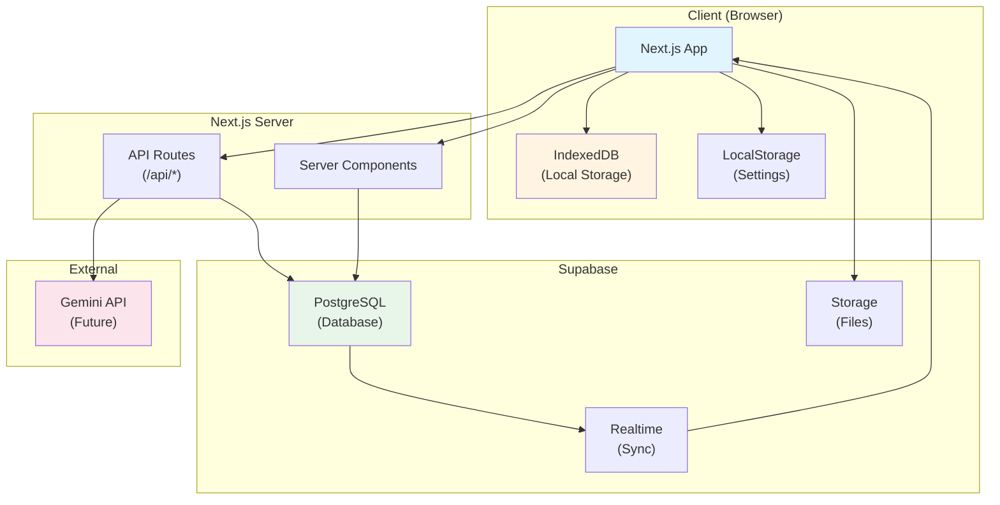
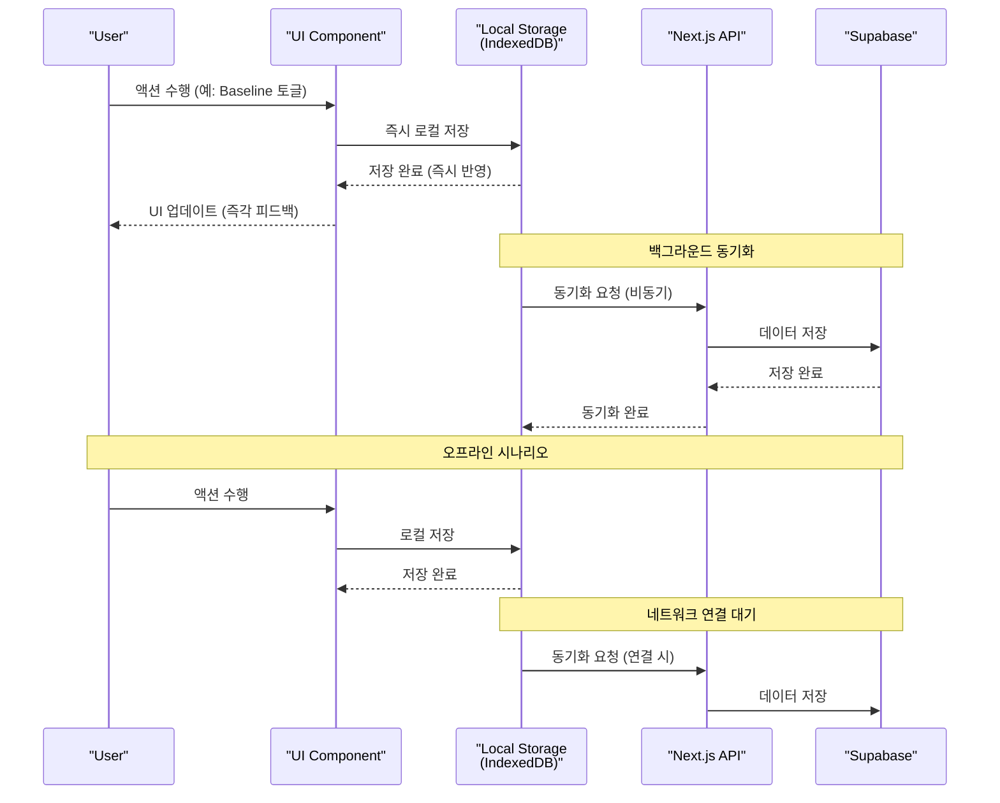
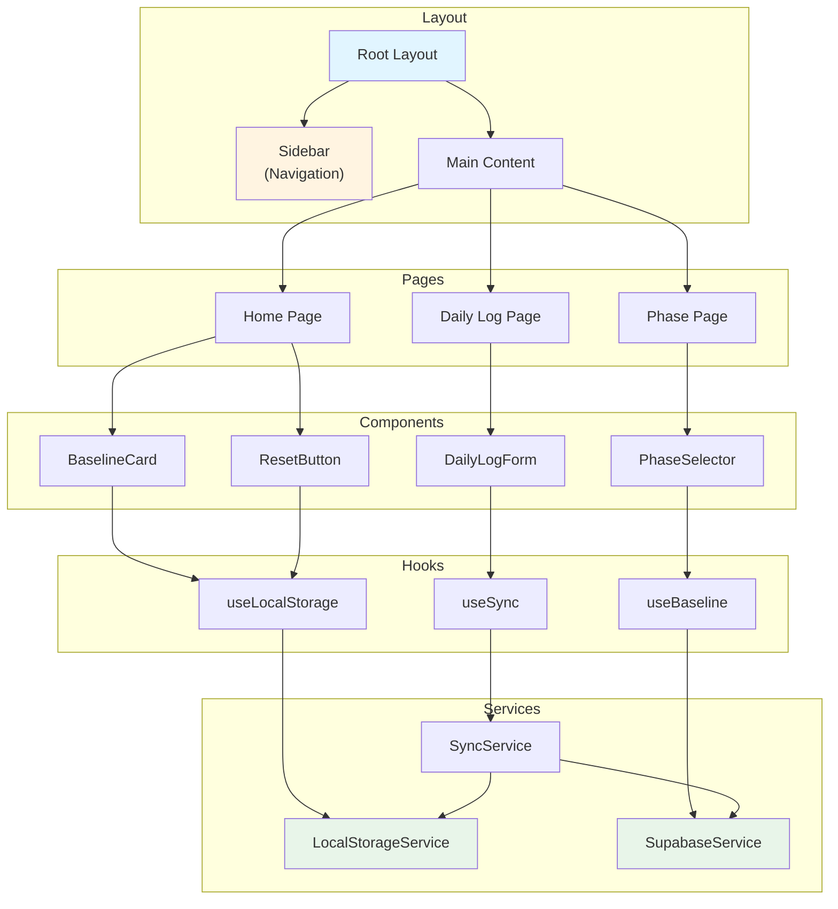
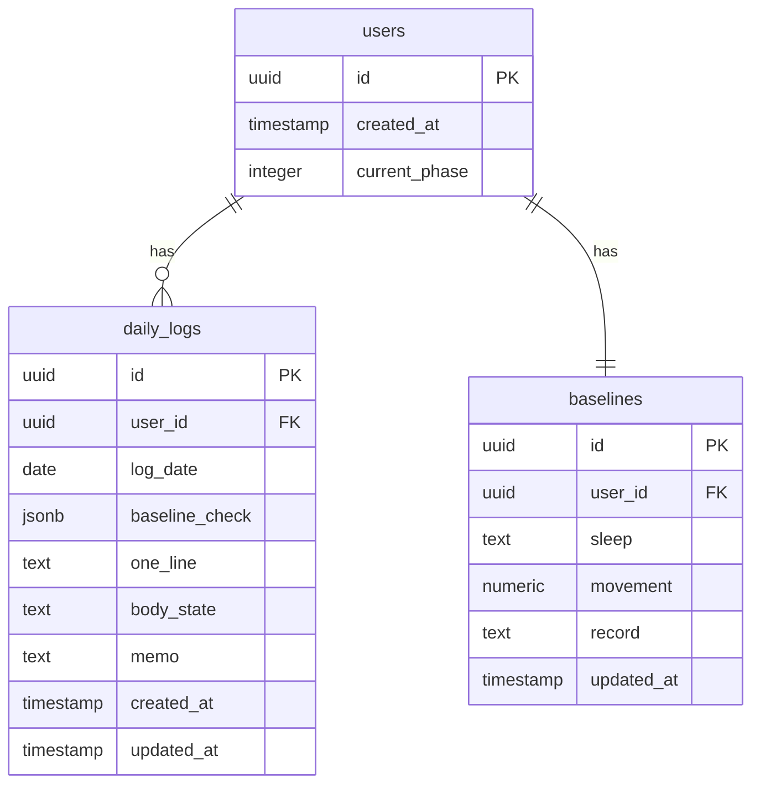
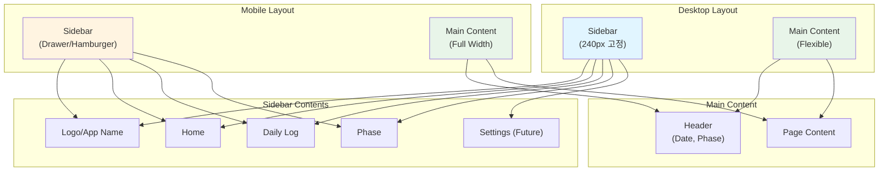
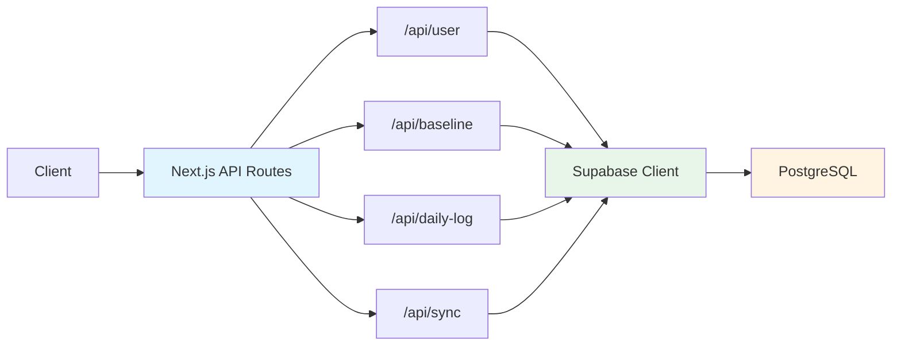
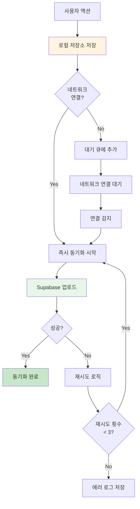

# LIFE OS - Software Design & Architecture
## 개발 디자인 및 아키텍쳐 문서

**버전**: v0.1  
**작성일**: 2025-01-27  
**기준 문서**: 
- [lifeos_PRD.md](./lifeos_PRD.md)
- [user_stories.md](./user_stories.md)

---

## 1. 기술 스택

### 1.1 프론트엔드/백엔드
- **Next.js 14+** (App Router)
  - React 18+
  - TypeScript
  - Server Components & Client Components
  - API Routes (백엔드 API)
  - SSR/SSG 최적화

### 1.2 데이터베이스/스토리지/인증
- **Supabase**
  - PostgreSQL 데이터베이스
  - 실시간 데이터 동기화 (Realtime)
  - Row Level Security (RLS)
  - Storage (필요 시 파일 저장)
  - 익명 사용자 지원 (로그인 없이 사용 가능)

### 1.3 AI 기능 (향후 확장)
- **Google Gemini API**
  - 일기 분석 및 인사이트 제공
  - 개인화된 조언 및 회복 지원

### 1.4 로컬 저장소
- **IndexedDB** (주 저장소)
  - 대용량 데이터 저장
  - 오프라인 지원
- **LocalStorage** (보조 저장소)
  - 설정 및 간단한 데이터

### 1.5 스타일링
- **Tailwind CSS**
  - 유틸리티 기반 스타일링
  - 반응형 디자인
  - 구글 캘린더 스타일 참고

### 1.6 상태 관리
- **React Context API** + **useReducer**
  - 전역 상태 관리
  - 로컬 저장소 동기화
- **React Query (TanStack Query)**
  - 서버 상태 관리
  - 캐싱 및 동기화

---

## 2. 시스템 아키텍쳐

### 2.1 전체 아키텍쳐 다이어그램



### 2.2 데이터 흐름 다이어그램



### 2.3 컴포넌트 아키텍쳐



---

## 3. 데이터베이스 설계

### 3.1 데이터베이스 스키마 다이어그램



### 3.2 테이블 상세 설계

#### 3.2.1 users 테이블
```sql
CREATE TABLE users (
    id UUID PRIMARY KEY DEFAULT gen_random_uuid(),
    created_at TIMESTAMP WITH TIME ZONE DEFAULT NOW(),
    current_phase INTEGER NOT NULL DEFAULT 1 CHECK (current_phase >= 1 AND current_phase <= 4)
);

-- 익명 사용자 지원을 위한 인덱스
CREATE INDEX idx_users_created_at ON users(created_at);
```

#### 3.2.2 baselines 테이블
```sql
CREATE TABLE baselines (
    id UUID PRIMARY KEY DEFAULT gen_random_uuid(),
    user_id UUID NOT NULL REFERENCES users(id) ON DELETE CASCADE,
    sleep TEXT NOT NULL DEFAULT '22:00-05:00',
    movement NUMERIC(5,2) NOT NULL DEFAULT 1.0,
    record TEXT NOT NULL DEFAULT '3줄',
    updated_at TIMESTAMP WITH TIME ZONE DEFAULT NOW(),
    UNIQUE(user_id)
);

CREATE INDEX idx_baselines_user_id ON baselines(user_id);
```

#### 3.2.3 daily_logs 테이블
```sql
CREATE TABLE daily_logs (
    id UUID PRIMARY KEY DEFAULT gen_random_uuid(),
    user_id UUID NOT NULL REFERENCES users(id) ON DELETE CASCADE,
    log_date DATE NOT NULL,
    baseline_check JSONB NOT NULL DEFAULT '{"sleep": false, "movement": false, "record": false}',
    one_line TEXT NOT NULL DEFAULT '',
    body_state TEXT CHECK (body_state IN ('good', 'normal', 'heavy')),
    memo TEXT,
    created_at TIMESTAMP WITH TIME ZONE DEFAULT NOW(),
    updated_at TIMESTAMP WITH TIME ZONE DEFAULT NOW(),
    UNIQUE(user_id, log_date)
);

CREATE INDEX idx_daily_logs_user_id ON daily_logs(user_id);
CREATE INDEX idx_daily_logs_date ON daily_logs(log_date);
CREATE INDEX idx_daily_logs_user_date ON daily_logs(user_id, log_date);
```

### 3.3 Row Level Security (RLS) 정책

```sql
-- users 테이블: 익명 사용자도 자신의 데이터에 접근 가능
ALTER TABLE users ENABLE ROW LEVEL SECURITY;

CREATE POLICY "Users can access their own data"
    ON users FOR ALL
    USING (auth.uid() = id OR auth.role() = 'anon');

-- baselines 테이블
ALTER TABLE baselines ENABLE ROW LEVEL SECURITY;

CREATE POLICY "Users can access their own baselines"
    ON baselines FOR ALL
    USING (auth.uid() = user_id OR auth.role() = 'anon');

-- daily_logs 테이블
ALTER TABLE daily_logs ENABLE ROW LEVEL SECURITY;

CREATE POLICY "Users can access their own daily logs"
    ON daily_logs FOR ALL
    USING (auth.uid() = user_id OR auth.role() = 'anon');
```

### 3.4 TypeScript 타입 정의

```typescript
// types/database.ts

export interface User {
  id: string;
  created_at: string;
  current_phase: 1 | 2 | 3 | 4;
}

export interface Baseline {
  id: string;
  user_id: string;
  sleep: string;
  movement: number;
  record: string;
  updated_at: string;
}

export interface BaselineCheck {
  sleep: boolean;
  movement: boolean;
  record: boolean;
}

export type BodyState = 'good' | 'normal' | 'heavy';

export interface DailyLog {
  id: string;
  user_id: string;
  log_date: string; // YYYY-MM-DD
  baseline_check: BaselineCheck;
  one_line: string;
  body_state: BodyState | null;
  memo: string | null;
  created_at: string;
  updated_at: string;
}
```

---

## 4. 프론트엔드 설계

### 4.1 디자인 시스템

#### 4.1.1 디자인 원칙
- **구글 캘린더 스타일 참고**
  - 깔끔한 레이아웃
  - 부드러운 색상 톤
  - 명확한 정보 계층
  - 여백 활용

#### 4.1.2 색상 팔레트
```typescript
// tailwind.config.ts
const colors = {
  primary: {
    50: '#f0f9ff',
    100: '#e0f2fe',
    200: '#bae6fd',
    300: '#7dd3fc',
    400: '#38bdf8',
    500: '#0ea5e9', // 메인 컬러
    600: '#0284c7',
    700: '#0369a1',
  },
  baseline: {
    on: '#10b981', // 부드러운 초록
    off: '#e5e7eb', // 부드러운 회색
  },
  reset: {
    default: '#f59e0b', // 부드러운 주황
    hover: '#d97706',
  },
  phase: {
    1: '#6366f1', // 인디고
    2: '#8b5cf6', // 보라
    3: '#ec4899', // 핑크
    4: '#f59e0b', // 앰버
  },
}
```

#### 4.1.3 타이포그래피
- **폰트**: Inter 또는 Noto Sans KR
- **크기**: 
  - 제목: text-2xl ~ text-4xl
  - 본문: text-base ~ text-lg
  - 작은 텍스트: text-sm

### 4.2 레이아웃 구조

#### 4.2.1 레이아웃 다이어그램



#### 4.2.2 반응형 브레이크포인트
```typescript
// tailwind.config.ts
const screens = {
  sm: '640px',   // 모바일
  md: '768px',   // 태블릿
  lg: '1024px',  // 데스크톱
  xl: '1280px',  // 큰 데스크톱
}
```

### 4.3 컴포넌트 구조

#### 4.3.1 디렉토리 구조
```
app/
├── layout.tsx              # Root Layout
├── page.tsx                # Home Page
├── daily-log/
│   └── page.tsx            # Daily Log Page
├── phase/
│   └── page.tsx            # Phase Page
├── api/
│   ├── sync/
│   │   └── route.ts        # 동기화 API
│   └── user/
│       └── route.ts        # 사용자 API
components/
├── layout/
│   ├── Sidebar.tsx         # 사이드바
│   └── Header.tsx          # 헤더
├── home/
│   ├── BaselineCard.tsx    # Baseline 카드
│   ├── ResetButton.tsx     # Reset 버튼
│   └── PhaseIndicator.tsx   # Phase 표시
├── daily-log/
│   ├── DailyLogForm.tsx    # 기록 폼
│   └── DatePicker.tsx      # 날짜 선택
├── phase/
│   └── PhaseSelector.tsx   # Phase 선택
└── common/
    ├── Button.tsx          # 공통 버튼
    └── Toggle.tsx          # 토글 스위치
hooks/
├── useLocalStorage.ts      # 로컬 저장소 훅
├── useSync.ts             # 동기화 훅
└── useBaseline.ts          # Baseline 훅
services/
├── LocalStorageService.ts  # 로컬 저장소 서비스
├── SupabaseService.ts      # Supabase 서비스
└── SyncService.ts          # 동기화 서비스
types/
└── database.ts             # 타입 정의
```

#### 4.3.2 주요 컴포넌트 설계

**Sidebar 컴포넌트**
```typescript
// components/layout/Sidebar.tsx
interface SidebarProps {
  currentPath: string;
  isOpen: boolean;
  onClose: () => void;
}

// 기능:
// - 네비게이션 메뉴
// - 현재 페이지 하이라이트
// - 모바일: Drawer 형태
// - 데스크톱: 고정 사이드바
```

**BaselineCard 컴포넌트**
```typescript
// components/home/BaselineCard.tsx
interface BaselineCardProps {
  type: 'sleep' | 'movement' | 'record';
  label: string;
  value: string;
  isChecked: boolean;
  onToggle: () => void;
}

// 기능:
// - Baseline 항목 표시
// - ON/OFF 토글
// - 구글 캘린더 스타일 카드
```

**DailyLogForm 컴포넌트**
```typescript
// components/daily-log/DailyLogForm.tsx
interface DailyLogFormProps {
  date: string;
  initialData?: DailyLog;
  onSave: (data: DailyLogInput) => void;
}

// 기능:
// - 오늘의 기준 한 줄 입력
// - 몸 상태 선택 (라디오)
// - 자유 메모 입력
// - 저장 버튼
```

### 4.4 상태 관리

#### 4.4.1 전역 상태 구조
```typescript
// contexts/AppContext.tsx
interface AppState {
  user: User | null;
  baseline: Baseline | null;
  currentPhase: 1 | 2 | 3 | 4;
  syncStatus: 'idle' | 'syncing' | 'success' | 'error';
}

interface AppContextValue {
  state: AppState;
  dispatch: React.Dispatch<AppAction>;
  // Actions
  updateBaseline: (baseline: Partial<Baseline>) => void;
  updateDailyLog: (log: DailyLog) => void;
  updatePhase: (phase: 1 | 2 | 3 | 4) => void;
  resetToday: () => void;
}
```

#### 4.4.2 로컬 저장소 동기화
```typescript
// hooks/useLocalStorage.ts
export function useLocalStorage<T>(
  key: string,
  initialValue: T
): [T, (value: T) => void] {
  // IndexedDB를 통한 로컬 저장
  // 자동 동기화 트리거
}
```

---

## 5. 백엔드 설계

### 5.1 API 라우트 구조

#### 5.1.1 API 엔드포인트

```
/api/user
  GET    - 사용자 정보 조회
  POST   - 사용자 생성 (최초 실행 시)

/api/baseline
  GET    - Baseline 조회
  PUT    - Baseline 업데이트

/api/daily-log
  GET    - Daily Log 조회 (날짜별)
  POST   - Daily Log 생성
  PUT    - Daily Log 업데이트

/api/sync
  POST   - 동기화 요청 (로컬 → Supabase)
  GET    - 동기화 상태 확인
```

#### 5.1.2 API 라우트 다이어그램



### 5.2 동기화 서비스

#### 5.2.1 동기화 로직

```typescript
// services/SyncService.ts
export class SyncService {
  // 로컬 → Supabase 동기화
  async syncToSupabase(localData: LocalData): Promise<void> {
    // 1. 로컬 데이터 읽기
    // 2. Supabase에 업로드
    // 3. 충돌 해결 (로컬 우선)
    // 4. 동기화 상태 업데이트
  }
  
  // Supabase → 로컬 동기화 (초기 로드 시)
  async syncFromSupabase(): Promise<LocalData> {
    // 1. Supabase에서 데이터 조회
    // 2. 로컬 데이터와 병합
    // 3. 로컬 저장소에 저장
  }
  
  // 백그라운드 동기화
  async backgroundSync(): Promise<void> {
    // 네트워크 상태 확인
    // 대기 중인 동기화 작업 실행
    // 재시도 로직
  }
}
```

#### 5.2.2 동기화 플로우 다이어그램



### 5.3 Supabase 클라이언트 설정

```typescript
// lib/supabase.ts
import { createClient } from '@supabase/supabase-js';

const supabaseUrl = process.env.NEXT_PUBLIC_SUPABASE_URL!;
const supabaseAnonKey = process.env.NEXT_PUBLIC_SUPABASE_ANON_KEY!;

export const supabase = createClient(supabaseUrl, supabaseAnonKey, {
  auth: {
    persistSession: false, // 로그인 없이 사용
    autoRefreshToken: false,
  },
  realtime: {
    params: {
      eventsPerSecond: 10,
    },
  },
});
```

---

## 6. 프론트엔드 상세 디자인

### 6.1 Home 화면 디자인

#### 6.1.1 레이아웃
```
┌─────────────────────────────────────────┐
│  Sidebar  │  Main Content               │
│           │  ┌───────────────────────┐   │
│  Home     │  │ 2025년 1월 27일 월요일 │   │
│  Daily    │  │ Phase 1: Baseline    │   │
│  Log      │  └───────────────────────┘   │
│  Phase    │                              │
│           │  ┌───────────────────────┐   │
│           │  │ 수면: 22:00-05:00     │   │
│           │  │ [ON/OFF 토글]         │   │
│           │  └───────────────────────┘   │
│           │  ┌───────────────────────┐   │
│           │  │ 이동: 1km 이상        │   │
│           │  │ [ON/OFF 토글]         │   │
│           │  └───────────────────────┘   │
│           │  ┌───────────────────────┐   │
│           │  │ 기록: 3줄              │   │
│           │  │ [ON/OFF 토글]         │   │
│           │  └───────────────────────┘   │
│           │                              │
│           │  [🔄 Reset Today]           │
└───────────┴──────────────────────────────┘
```

#### 6.1.2 컴포넌트 구조
- **Header**: 날짜, Phase 표시
- **BaselineCard** (3개): 수면, 이동, 기록
- **ResetButton**: Reset Today 버튼

### 6.2 Daily Log 화면 디자인

#### 6.2.1 레이아웃
```
┌─────────────────────────────────────────┐
│  Sidebar  │  Main Content               │
│           │  ┌───────────────────────┐   │
│  Home     │  │ 2025년 1월 27일       │   │
│  Daily    │  └───────────────────────┘   │
│  Log      │                              │
│  Phase    │  오늘의 기준 한 줄            │
│           │  ┌───────────────────────┐   │
│           │  │ [텍스트 입력 필드]     │   │
│           │  └───────────────────────┘   │
│           │                              │
│           │  몸 상태                      │
│           │  ○ 좋음  ○ 보통  ○ 무거움   │
│           │                              │
│           │  자유 메모                    │
│           │  ┌───────────────────────┐   │
│           │  │ [여러 줄 텍스트 영역]   │   │
│           │  └───────────────────────┘   │
│           │                              │
│           │  [저장]                      │
└───────────┴──────────────────────────────┘
```

### 6.3 Phase 화면 디자인

#### 6.3.1 레이아웃
```
┌─────────────────────────────────────────┐
│  Sidebar  │  Main Content               │
│           │  ┌───────────────────────┐   │
│  Home     │  │ 현재 Phase            │   │
│  Daily    │  │ Phase 1: Baseline    │   │
│  Log      │  └───────────────────────┘   │
│  Phase    │                              │
│           │  Phase 설명                   │
│           │  기본 기준 회복               │
│           │                              │
│           │  Phase 변경                   │
│           │  [Phase 1 ▼]                 │
│           │                              │
│           │  ┌───────────────────────┐   │
│           │  │ Phase 1: Baseline     │   │
│           │  │ Phase 2: Stability    │   │
│           │  │ Phase 3: Growth       │   │
│           │  │ Phase 4: Identity     │   │
│           │  └───────────────────────┘   │
└───────────┴──────────────────────────────┘
```

### 6.4 반응형 디자인

#### 6.4.1 모바일 레이아웃
- **Sidebar**: 햄버거 메뉴로 변환
- **Drawer**: 왼쪽에서 슬라이드
- **메인 콘텐츠**: 전체 너비 사용
- **터치 친화적**: 버튼 크기 최소 44px

#### 6.4.2 태블릿 레이아웃
- **Sidebar**: 접을 수 있는 사이드바
- **메인 콘텐츠**: Sidebar와 함께 표시

#### 6.4.3 데스크톱 레이아웃
- **Sidebar**: 고정 사이드바 (240px)
- **메인 콘텐츠**: 나머지 공간 활용
- **최대 너비**: 1280px (중앙 정렬)

---

## 7. 성능 최적화

### 7.1 로딩 최적화
- **Next.js SSR/SSG**: 초기 로딩 최적화
- **코드 스플리팅**: 페이지별 분리
- **이미지 최적화**: Next.js Image 컴포넌트
- **폰트 최적화**: next/font 사용

### 7.2 데이터 최적화
- **로컬 우선**: 즉시 반응
- **백그라운드 동기화**: 사용자 경험 방해 없음
- **캐싱**: React Query 활용
- **인덱싱**: 데이터베이스 인덱스 최적화

### 7.3 오프라인 지원
- **Service Worker**: PWA 지원 (향후)
- **로컬 저장소**: IndexedDB 활용
- **동기화 큐**: 오프라인 작업 저장

---

## 8. 보안 고려사항

### 8.1 데이터 보안
- **RLS 정책**: Supabase Row Level Security
- **익명 사용자**: UUID 기반 식별
- **HTTPS**: 모든 통신 암호화

### 8.2 클라이언트 보안
- **환경 변수**: API 키 보호
- **XSS 방지**: React 기본 보안
- **CSRF 방지**: Next.js 기본 보호

---

## 9. 배포 전략

### 9.1 빌드 및 배포
- **Next.js 빌드**: `next build`
- **배포 플랫폼**: Vercel (권장) 또는 다른 플랫폼
- **환경 변수**: Supabase 설정

### 9.2 모니터링
- **에러 추적**: Sentry (선택)
- **성능 모니터링**: Vercel Analytics
- **사용자 분석**: 최소한의 분석 (철학 준수)

---

## 10. 향후 확장 계획

### 10.1 Gemini API 연동
- **일기 분석**: Daily Log 텍스트 분석
- **인사이트 제공**: 패턴 발견
- **조용한 지원**: 압박감 없는 제안

### 10.2 PWA 지원
- **Service Worker**: 오프라인 지원 강화
- **앱 설치**: 홈 화면 추가
- **푸시 알림**: 최소한만 (선택적)

---

## 11. 참고 문서

- [lifeos_PRD.md](./lifeos_PRD.md) - 제품 요구사항 문서
- [user_stories.md](./user_stories.md) - 사용자 스토리
- [Next.js Documentation](https://nextjs.org/docs)
- [Supabase Documentation](https://supabase.com/docs)
- [Google Calendar Design](https://calendar.google.com) - 디자인 참고

---

## 12. 승인 및 검토

**작성자**: Development Team  
**검토자**: [미정]  
**승인일**: [미정]

---

> 이 소프트웨어 디자인 문서는 MVP 개발을 위한 기술적 기준 문서입니다.  
> 모든 개발 작업은 이 문서의 아키텍쳐와 설계를 기반으로 진행되어야 합니다.  
> 기술 스택은 Next.js, Supabase, Gemini API로 고정하며, 이 외의 기술은 명시하지 않습니다.

